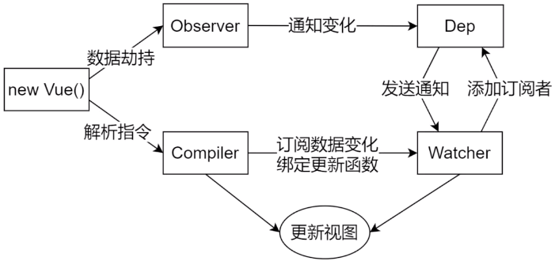
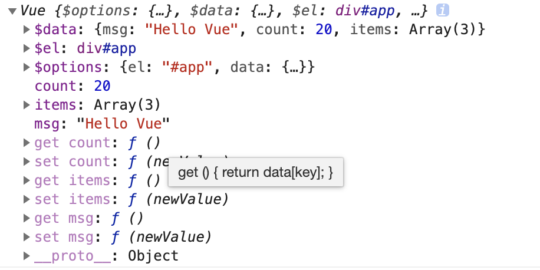
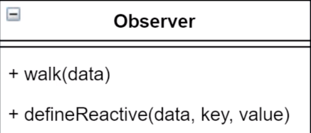
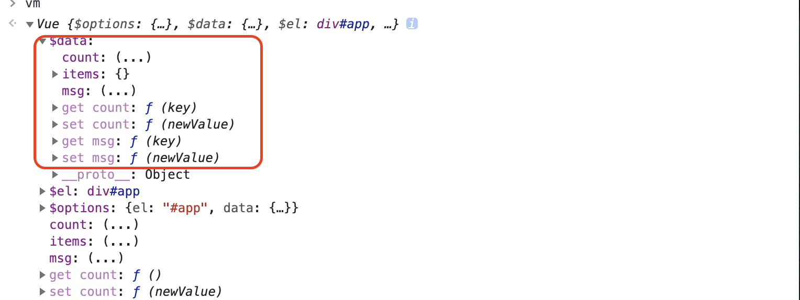
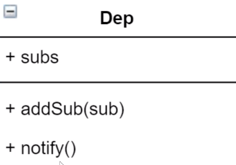
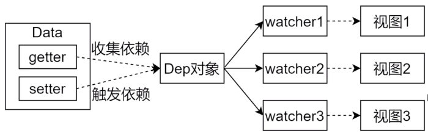
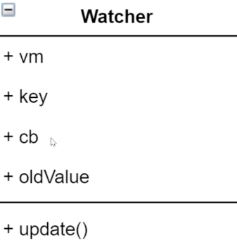

## Vue响应式原理模拟

### $index.html

开门见山,如下在html文件中可以看出,本次要模拟实现的的功能有:**`差值表达式`**,**`指令`**和**`双向数据绑定`**.

```html
<!DOCTYPE html>
<html lang="cn">
<head>
  <meta charset="UTF-8">
  <meta name="viewport" content="width=device-width, initial-scale=1.0">
  <meta http-equiv="X-UA-Compatible" content="ie=edge">
  <title>Vue 基础结构</title>
</head>
<body>
  <div id="app">
    <h1>差值表达式</h1>
    <h3>{{ msg }}</h3>
    <h3>{{ count }}</h3>
    <h1>v-text</h1>
    <div v-text="msg"></div>
    <h1>v-model</h1>
    <input type="text" v-model="msg">
    <input type="text" v-model="count">
  </div>
  
	<script src="./js/compiler.js"></script>
  <script src="./js/observer.js"></script>
  <script src="./js/vue.js"></script>
  <script>
    let vm = new Vue({
      el: '#app',
      data: {
        msg: 'Hello Vue',
        count: 20,
        items: {
          one : 1,
          two : 2,
        }
      }
    })
  </script>
</body>
</html>
```

### $各功能模块的整体结构



### 1.模拟Vue部分

- 创建vue.js并在index.html中引入.
- 1.负责接收初始化参数
- 2.把data中的成员注入到Vue实例,并且把data中的成员转成getter/setter
- 3.负责调用observer监听data中所有属性的变化,当属性变化的时候更新视图
- 4.负责调用compiler解析指令/插值表达式

接收初始化参数,把data中的成员注入到Vue实例,并且把data中的成员转成getter/setter

```js
class Vue {
  constructor (options) {
    // 1.- 接收初始化参数
    this.$options = options || {};
    this.$data = options.data || {};
    this.$el = typeof(options.el) === 'string' ? document.querySelector(options.el) : options.el;
    // 2.- 把data中的成员注入到Vue实例,并且把data中的成员转成get/set
    this._proxyData(this.$data);
    // 3.- 负责调用observer监听data中所有属性的变化,当属性变化的时候更新视图
    new Observer(this.$data);
    // 4.- 负责调用compiler解析指令/插值表达式
    new Compiler(this);
  }
  //代理data中的数据
  _proxyData (data) {
    //遍历data中的所以属性
    Object.keys(data).forEach(key=>{
      //把data属性的get和set注入到Vue实例中
      Object.defineProperty(this,key,{
        enumerable : true,
        configurable : true,
        get () {
          return data[key];
        },
        set (newValue) {
          if(newValue !== data[key]){
            data[key] = newValue
          }
        }
      })
    })
    console.log(this);
  }
}
```

执行index.html,控制台打印vm实例



### 2.模拟Observer部分

- 创建observer.js并在index.html中引入.创建好类之后在vue.js的第三步实例化observer对象.
- 1.负责把data选项中的属性转换成响应式数据
- 2.data中的某个属性也是对象,把该对象转换成响应式数据
- 3.监听数据对象的所有属性,有变动拿到最新值并通知Dep
- **类图**



`walk`用来遍历vue实例中的`this.$data`对象,遍历所有属性并调用defineReactive;

`defineReactive`把data中的属性转换成get和set.

```js
class Observer {
  constructor ($data) {
    this.walk($data)
  }
  walk ($data) {
    //data必须是object
    if(!$data || typeof($data) !== 'object') return
    Object.keys($data).forEach(key=>{
      this.defineReactive($data,key,$data[key])
    })
  }
  defineReactive(obj ,key, value) {
    //递归对象属性
    this.walk(value);
    let self = this;
    Object.defineProperty(obj,key,{
      enumerable : true,
      configurable : true,
      get (key) {
        return value
      },
      set (newValue) {
        if(newValue !== value){
          value = newValue
          //如果赋值的是一个对象,那么对它设置get和set
          self.walk(newValue)
        }
      }
      //发送通知
    })
  }
}
```

**注意**:当属性变化时首先会触发vue.js中的get然后再触发observe.js中的get. 此时defineReactive中之所以要传一个value值,是为了对这个值进行闭包缓存. 因为在vue.js和observe.js中监听的都是$data对象的属性,所以为了避免死递归才传的这个value.而obj ,key为undefined是因为get中没有被用到.

在index.html,控制台打印vm实例



### 3.模拟Compiler部分

- 负责编译模板,解析每个元素中的指令/插值表达式替换成相应的数据

- 负责页面的首次渲染

- 当数据变化后重新渲染视图

- **类图**

  

  **el**:模板

  **vm**:实例

  **compile(el)**:编译所有节点,处理文本节点和元素节点

  **compileElement(node)**:编译元素节点中的属性及指令

  **compileText(node)**:编译文本节点中的插值表达式

  **isDirective(attrName)**:判断元素属性是否是指令

  **isTextNode(node)**:判断节点是否是文本节点

  **isElementNode(node)**:判断节点是否是元素节点

  | 节点类型 | 说明                                                    | nodeType |
  | -------- | ------------------------------------------------------- | -------- |
  | 元素节点 | 每一个HTML标签都是一个元素节点，如 div 、 p、ul标签等 | 1        |
  | 属性节点 | 元素节点（HTML标签）的属性，如 id 、class 、name 等。   | 2        |
  | 文本节点 | 元素节点或属性节点中的文本内容。                        | 3        |
  | 注释节点 | 表示文档注释，形式为<!-- comment text -->。             | 8        |
  | 文档节点 | 表示整个文档（DOM 树的根节点，即 document ）            | 9        |

```js
class Compiler {
  constructor (vm) {
    this.vm = vm;
    this.el = vm.$el;
    this.compile(this.el);
  }
  //遍历对象中所有节点,并判断节点是文本节点还是元素节点
  //eg: <p class="lucy"> Hello,World </p>
  //Hello,World属于文本节点
  //p属于元素节点
  //class="lucy"属于属性节点
  compile (el) {
    //注意这里应该是childNodes而不是children
    //childNodes返回的是节点的第一层子节点集合，包括元素节点、文本节点还有属性节点。
    //children返回的只是节点的第一层元素节点集合。
    //返回的是一个伪数组
    let childNodes = el.childNodes;
    Array.from(el.childNodes).forEach(node=>{
      if(this.isTextNode(node)){
        //处理文本节点
        this.compileText(node)
      }else if (this.isElementNode(node)){
        //处理元素节点
        this.compileElement(node)
      }
      //判断node节点是否有子节点,如果有递归调用compile
      if(node.childNodes && node.childNodes.length){
        this.compile(node);
      }
    })
  }
  //解析元素节点中的属性及指令
  compileElement (node) {
    Array.from(node.attributes).forEach(attr=>{
      if(this.isDirective(attr.name)){
        const arrtName = attr.name.substr(2);// v-text => text
        const key = attr.value;// msg
        this.updata(node,key,arrtName);
      }
    })
  }

  //解析函数
  updata (node,key,arrtName) {
    //不同的指令调用不同的方法
    this[`${arrtName}Updater`] && this[`${arrtName}Updater`](node,this.vm[key]);
  }

  //处理v-text指令
  textUpdater (node, text) {
    node.textContent = text;
  }

  //处理v-model指令
  modelUpdater (node, value) {
    node.value = value;
  }

  //解析文本节点中的插值表达式
  compileText (node) {
    // console.dir(node);
    const reg = /\{\{(.+?)\}\}/g;
    let value = node.textContent;
    if(reg.test(value)){
      value.replace(reg,(x,$1)=>{
        // 有多个插值表达式时
        node.textContent = node.textContent.replace(x,this.vm[$1.trim()])
      })
    }
  }
  //判断元素属性是否是指令
  isDirective (attrName) {
    return attrName.startsWith('v-');
  }
  //判断节点是否是文本节点
  isTextNode (node) {
    return node.nodeType === 3;
  }
  //判断节点是否是元素节点
  isElementNode (node) {
    return node.nodeType === 1;
  }
}
```

### 4.模拟Dep发布者

- 作用是添加观察者.

- 当数据变化的时候,通知所有的观察者.

- **类图**

  

  **subs**:存储观察者.

  **addSub**:添加观察者并约定每个观察者必须有updata方法.

  **notify**:发布通知给所有观察者.

### 5.模拟Watcher



- 当第一次渲染模板并获取data中的数据时收集依赖;当数据变化时触发依赖,dep通知所有的watcher实例的updata方法更新视图.

- 自身实例化的时候往dep中添加自己.

- **类图**

  

**vm**:实例

**key**:data中的属性名称

**cb**:回调函数负责更新视图

**oldValue**:旧属性值

**updata**:当数据发生变化的时候更新视图

**watcher中的代码实现`观察者`类**

```js
class Watcher {
  constructor (vm,key,cb) {
    this.vm = vm;
    this.key = key;
    //回调函数负责更新视图
    this.cb = cb;
    //把当前的watcher对象记录到dep类的静态属性target中
    Dep.target = this;
    //vm[key]会触发属性的get方法,在get方法中会调用addSub
    this.oldValue = vm[key];
    //为了避免重复调用addSub,target要置为空
    Dep.target = null; 
  }
  //更新视图
  update () {
    const newValue = this.vm[this.key];
    if(newValue === this.oldValue) return;
    this.cb(this.oldValue,newValue);
    //新的数据在下次变更的时候就是旧的数据了
    this.oldValue = newValue;
  }
}
```

**`依赖收集`与`发布通知`**

在Observer类的defineReactive函数的get和set中触发与发布通知.

```js
get (key) {
  //这行代码会在实例化Watcher的时候被触发
  Dep.target && dep.addSub(Dep.target); 
  return value
},
  set (newValue) {
    if(newValue !== value){
      value = newValue;
      self.walk(newValue);
      //发送通知
      dep.notify();
    }
  }
```

**`更新视图`**

在Compiler类中实例化`new Watcher`在数据变化之后发布通知触发回调函数从而更新视图.

```js
//处理v-text指令
textUpdater (node, key ,text) {
  node.textContent = text;
  //视图更新
  new Watcher(this.vm,key,(oldValue,newData)=>{
    node.textContent = newData;
  })
}

//处理v-model指令
modelUpdater (node, key ,value) {
  node.value = value;
  //视图更新
  new Watcher(this.vm,key,(oldValue,newData)=>{
    node.value = newData;
  })
}

//解析文本节点中的插值表达式
compileText (node) {
  // console.dir(node);
  const reg = /\{\{(.+?)\}\}/g;
  let value = node.textContent;
  if(reg.test(value)){
    value.replace(reg,(x,$1)=>{
      const key = $1.trim();
      //利用闭包缓存最初是的模板值
      const val = RegExp.$_;
      // 有多个插值表达式时
      node.textContent = node.textContent.replace(x,this.vm[key]);
      // 利用闭包,Watcher在此处更新视图
      new Watcher(this.vm,key,(oldValue,newData)=>{
        let textContent = val; 
        //把旧的数据替换成新的数据
        textContent.replace(reg,(x,$1)=>{
          const key = $1.trim();
          // 有多个插值表达式时
          textContent = textContent.replace(x,this.vm[key]);
        })
        node.textContent = textContent;
      })
    })
  }
}
```

**`v-model`双向数据绑定**

改变Compiler类的`modelUpdater`函数给node注册一个`oninput`事件,当值发生改变的时候更新data中的属性,代码如下

```js
//处理v-model指令
modelUpdater (node, key ,value) {
  node.value = value;
  node.oninput = (newValue)=>{
    if(node.value === value) return;
    this.vm[key] = value = node.value;
    console.log(key,this.vm[key]);
  }
  //视图更新
  new Watcher(this.vm,key,(oldValue,newData)=>{
    node.value = newData;
  })
}
```

**html中文件引入顺序**

```html
<script src="./js/dep.js"></script>
<script src="./js/watcher.js"></script>
<script src="./js/compiler.js"></script>
<script src="./js/observer.js"></script>
<script src="./js/vue.js"></script>
```

### 6.问题

**问题1**:给属性重新赋值成对象,是否是响应式?

​		**答**:是响应式,重新赋值会触发Observer类的set,而set中又调用了walk函数.

**问题2**:给Vue实例新增一个成员是否是响应式?

​		**答**:不是响应式,对于已经创建的实例，Vue 不允许动态添加根级别的响应式 property。但是，可以使用 `Vue.set(object, propertyName, value)` 方法向嵌套对象添加响应式 property。例如，对于：

```js
Vue.set(vm.someObject, 'b', 2)
```

您还可以使用 `vm.$set` 实例方法，这也是全局 `Vue.set` 方法的别名：

```js
this.$set(this.someObject,'b',2)
```

**粗暴实现**:在vue.js中添加set方法

```js
set (object , propertyName , value){
  object[propertyName] = value
  // 2.- 把data中的成员注入到Vue实例,并且把data中的成员转成getter/setter
  this._proxyData(this.$data);
  // 3.- 负责调用observer监听data中所有属性的变化,当属性变化的时候更新视图
  new Observer(this.$data);
  // 4.- 负责调用compiler解析指令/插值表达式
  new Compiler(this);
}
```

**问题3**:在Vue中只有 Vue.js 中的选项 data (如：new Vue({ data: { } }))才可以设置为响应式对象吗?

​		**答**:不对,也可以使用 `Vue.observable()` 把任意对象转换成响应式对象，Vue.observable() 返回的对象没有办法在模板中直接使用，但是可以在 `h()` 函数中使用。

### 7.补充

#### [对于数组](https://cn.vuejs.org/v2/guide/reactivity.html#对于数组)

Vue 不能检测以下数组的变动：

1. 当你利用索引直接设置一个数组项时，例如：`vm.items[indexOfItem] = newValue`
2. 当你修改数组的长度时，例如：`vm.items.length = newLength`

举个例子：

```js
var vm = new Vue({
  data: {
    items: ['a', 'b', 'c']
  }
})
vm.items[1] = 'x' // 不是响应性的
vm.items.length = 2 // 不是响应性的
```

为了解决第一类问题，以下两种方式都可以实现和 `vm.items[indexOfItem] = newValue` 相同的效果，同时也将在响应式系统内触发状态更新：

```js
// Vue.set
Vue.set(vm.items, indexOfItem, newValue)
// Array.prototype.splice
vm.items.splice(indexOfItem, 1, newValue)
```

你也可以使用 [`vm.$set`](https://cn.vuejs.org/v2/api/#vm-set) 实例方法，该方法是全局方法 `Vue.set` 的一个别名：

```js
vm.$set(vm.items, indexOfItem, newValue)
```

为了解决第二类问题，你可以使用 `splice`：

```js
vm.items.splice(newLength)
```

